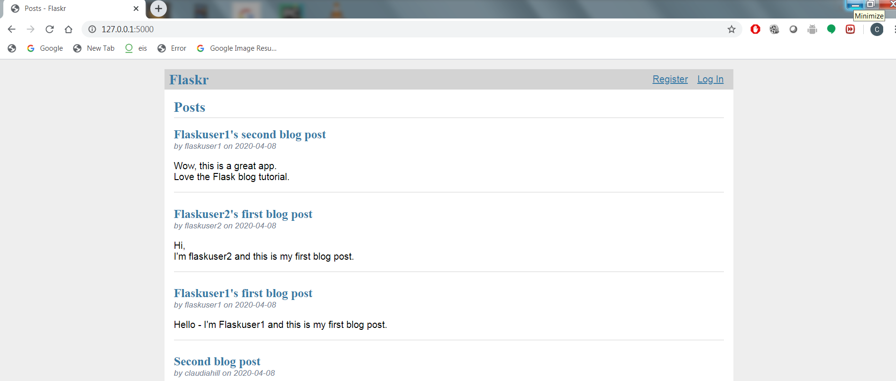
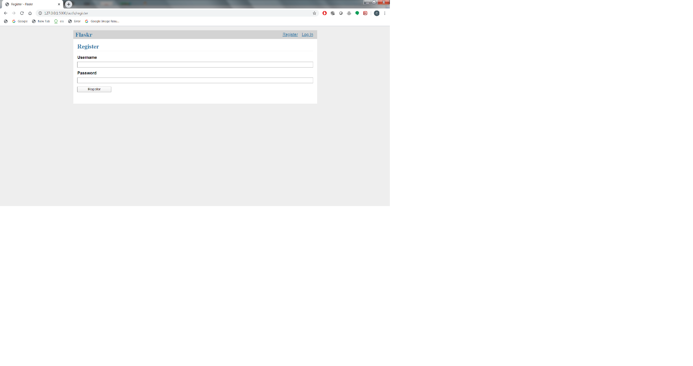
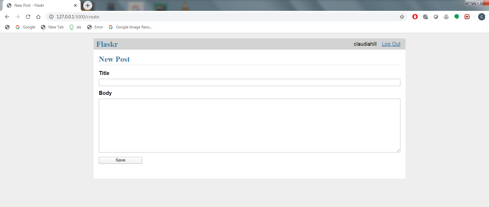

# flask-tutorial
Flask tutorial to create a blog

## Synopsis

Name: Flask blog

This is a Flask "light-weight" python web application which guides the user through creating a blog.

The Flask tutorial can be accessed here <https://flask.palletsprojects.com/en/1.1.x/tutorial/>

## Code Description

This website allows the user to register, then login and create, edit or delete a blog.  The user can see all the blogs posted.

Below are screen shots of the blog:

<kbd>|</kbd><kbd></kbd><kbd>|</kbd><kbd>|</kbd> 

## Motivation

Experiment with developing a website using Flask - python.

## Installation

Project can be downloaded from GitHub.  
https://github.com/hillc255/flask-tutorial

The original Flask project can be downloaded from GitHub
https://github.com/pallets/flask/tree/1.1.2/examples/tutorial

## API Reference

## Tests

Although test were created, there is a known defect using the version of "pytest" and "python" so these tests could not be run.
